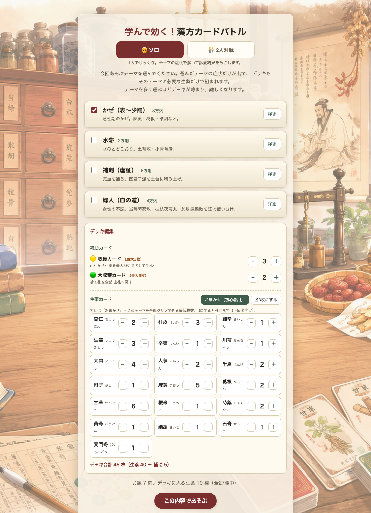
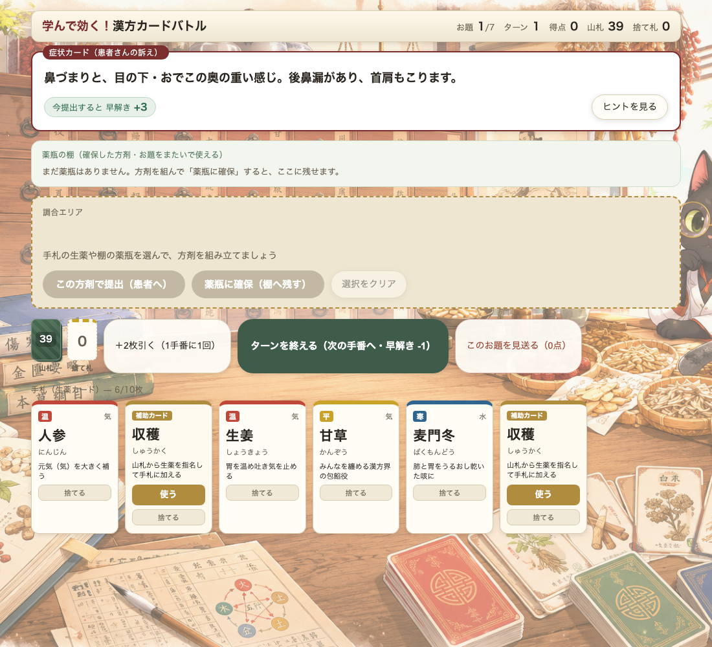
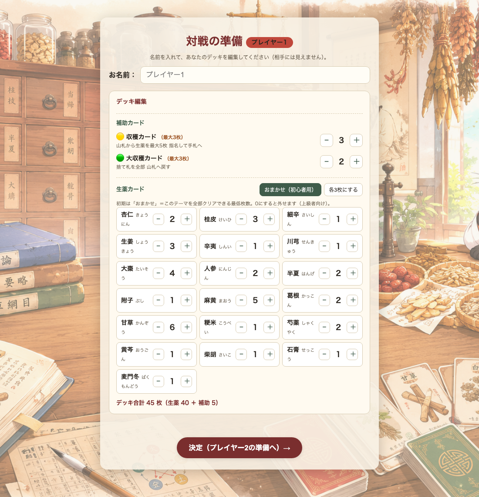
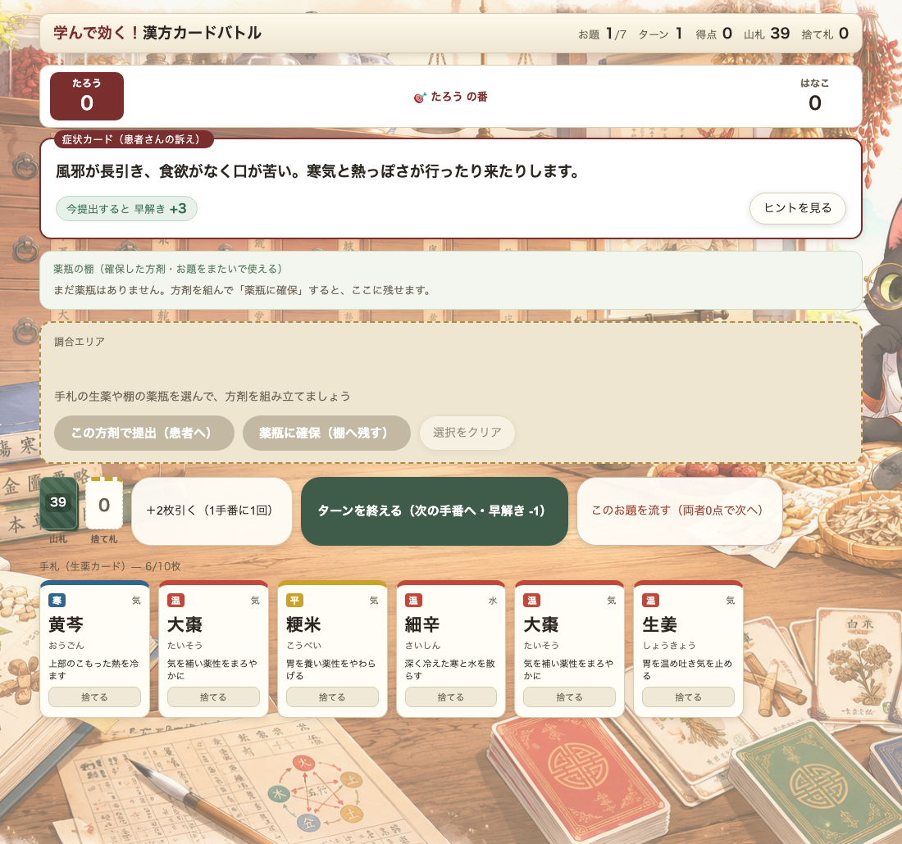

# 学んで効く！漢方カードバトル（お試し版）

生薬カードを組み合わせて方剤（漢方薬）をつくる、学習用カードゲームのお試し版です。
婦人・かぜ・補剤の3テーマを収録。**ソロ**と**2人対戦**で遊べます。

**制作: renoba6959** ／ ブログ: https://sirai-kusushi.com/

## ▶ 遊ぶ
- 公開ページ：https://renoba6959.github.io/kampo-otameshi/
- または `index.html` をブラウザで開くだけ（インストール・ネット接続不要）。

## 画面イメージ
| スタート（モード・テーマ・デッキ編集） | プレイ画面 |
| --- | --- |
|  |  |

| 対戦の準備（名前＋各自デッキ編集） | 2人対戦 |
| --- | --- |
|  |  |

## 遊び方
1. **モードとテーマを選ぶ**：ソロ／2人対戦を選び、遊ぶテーマ（婦人・かぜ・補剤）を選択。
2. **症状カード（お題）を読む**：患者さんの訴え（証）に合う方剤（漢方薬）を目指します。
3. **手札の生薬を組み合わせる**：手札の生薬カードを選び、構成生薬がそろうと方剤が成立。
   - 大きな方剤は「**薬瓶に確保**」して棚に残し、生薬や別の薬瓶を足して育てられます。
   - 「**＋2枚引く**」で手札を補充、「**ターンを終える**」で次の手番へ。
4. **提出**：お題に合う方剤ができたら「この方剤で提出」。証との一致度・早解き・薬味数で得点。
5. **ソロ**は全お題クリアで診療結果（称号）。**2人対戦**は、同じお題を先に解いた方が高得点、合計点で勝敗。

### 補助カード
- **収穫**：山札から生薬を指名して手札へ。／**大収穫**：捨て札を山札へ戻す。（お試し版は各1枚）

## 2人対戦について
同じ端末を交代で使います（🙈目隠しで受け渡し）。最初に各プレイヤーが**名前とデッキ**を設定し（相手には見えません）、同じお題を早く正しく解いた方が高得点。合計点で勝敗が決まります。

## 更新履歴
- **2026-07-14**
  - 🆚 **2人対戦モード**を追加（同じ端末を交代で使用・🙈目隠しで受け渡し／各プレイヤーが名前とデッキを設定／同じお題を早く正しく解いた方が高得点・合計点で勝敗）
  - 🎨 **背景イラスト**を追加（漢方薬局の世界観）
  - 🛠 操作性を改善（「＋2枚引く」などボタンの視認性アップ／引いた直後のカードが押せない不具合を修正）
  - 📖 READMEに画面イメージ・遊び方を追加
- **2026-07-13**
  - 🎉 **初公開（お試し版）**。婦人・かぜ・補剤の3テーマ・9方剤を収録。起動時に免責への同意画面。

## ご注意（免責）
⚠ 本アプリは漢方を楽しく学ぶための教育・娯楽目的の試作です。
医療上の診断・治療・処方の助言ではありません。体調不良は医師・薬剤師にご相談ください。
生薬の性質・方剤の効能などの記載は学習用のたたき台で、監修中の内容を含みます。

## フィードバック
※誤りや改善点にお気付きの方は、GitHubのIssueでご指摘ください。

## 素材について
背景画像は ChatGPT（DALL-E）で生成した独自の画像を使用しています。

## ライセンス・二次利用
本アプリのコード・データの二次利用については未定です。ご相談ください。

---
※このお試し版は本編データから自動生成した一部抜粋です。
